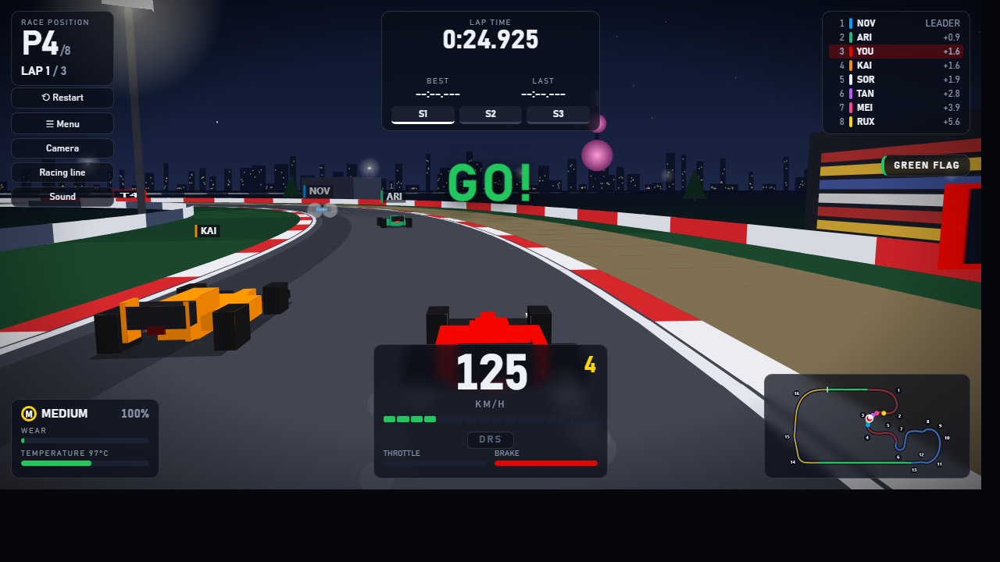
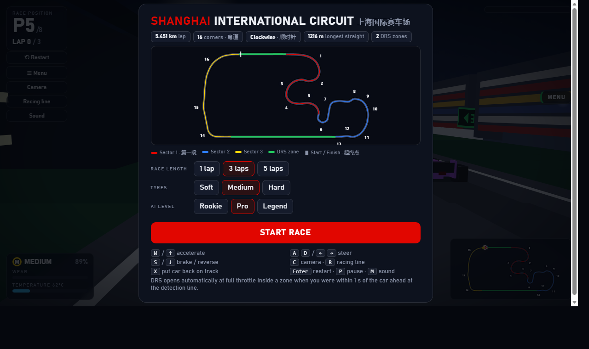
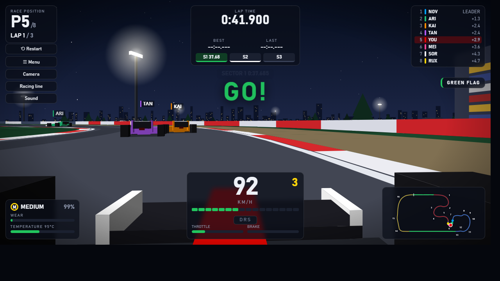
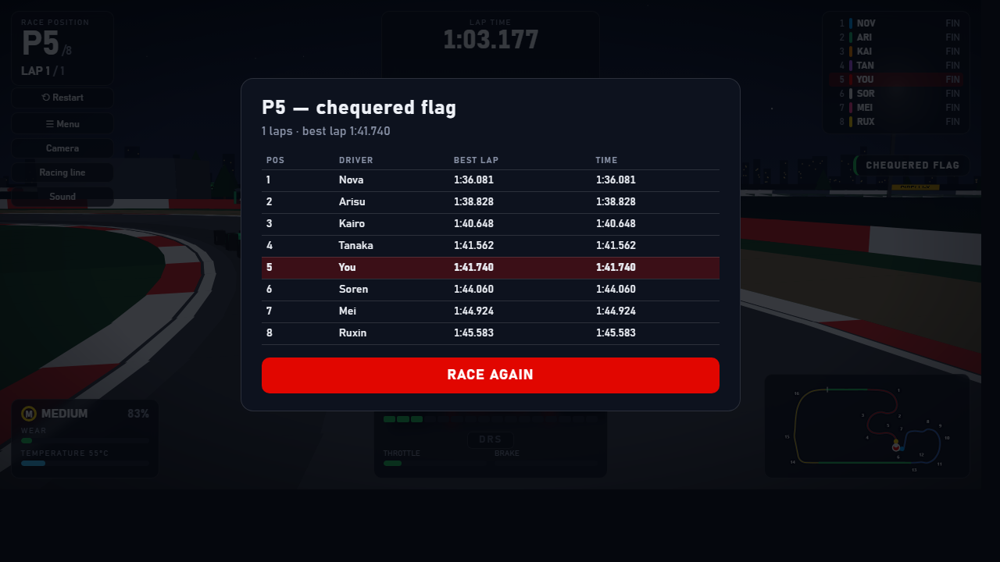

# Shanghai F1 · 上海国际赛车场

A playable, single-file racing simulator of the **Shanghai International Circuit** — pseudo-3D chase camera, real vehicle physics, 7 AI rivals, DRS, tyre model, ghost lap and sector timing. HTML + CSS + JavaScript only: no build step, no server, no framework, no external assets. Works offline.

## Play

Download `shanghai-f1-final.html` and open it in Chrome or Edge. That's it.

Or enable **GitHub Pages** (Settings → Pages → deploy from `main`, root) and open `…/shanghai-f1-final.html`.

| Key | Action |
|---|---|
| `W` / `↑` | Throttle |
| `S` / `↓` | Brake, then reverse |
| `A` `D` / `←` `→` | Steer (rate-limited, less lock at speed) |
| `C` | Camera: chase → high → onboard |
| `R` | Racing-line assist (green = accelerate, yellow = lift, red = brake) |
| `X` | Put the car back on the track |
| `P` | Pause |
| `M` | Mute |
| `Enter` | Start / restart |

DRS is automatic: it opens at full throttle inside a DRS zone if you were within 1 s of the car ahead at the detection line (after the first sector of the race).

Touch devices get on-screen left / right / throttle / brake buttons.

## Features

- **Track** — 5.451 km, 16 numbered corners, clockwise; opening T1→T2 tightening spiral, T6 hairpin, 1.2 km back straight. One shared track model (spline resampled at 4 m) feeds physics, AI, DRS, timing, renderer and minimap.
- **Physics** — slip-based arcade model: acceleration, braking, rolling resistance, aerodynamic drag, downforce, saturating lateral tyre force, friction circle, steering geometry with yaw, surface-dependent grip (asphalt / kerb / grass / gravel), four-corner barrier collisions, car-to-car collisions. Fixed 120 Hz step, rendering decoupled.
- **Tyres** — Soft / Medium / Hard. Temperature (cold → 95 °C window → overheating) and wear both change grip; cornering, braking and sliding heat the tyres.
- **AI** — 7 drivers with different pace, aggression and consistency, following a computed racing line with a braking/traction-limited speed profile (pure-pursuit steering). They overtake, defend, occasionally make mistakes, and recover when stuck. Difficulty (Rookie / Pro / Legend) changes pace and mistake rate. They use the same car physics as the player.
- **DRS** — real gameplay: detection line, 1 s gap rule, −45 % drag / −25 % downforce.
- **Race** — grid → lights → green flag → chequered flag → results. Lap and sector timing with sub-step interpolated line crossings; reversing over the line can't create laps; position from unwrapped race progress.
- **Ghost lap** — your best lap is recorded and replayed as a translucent car, with a live delta.
- **Rendering** — Canvas 2D perspective renderer (painter's algorithm, near-plane clipping, distance fog): kerbs, barriers, grass, gravel, grandstands, pit buildings, floodlights, signage, start gantry, trees, Shanghai skyline.
- **UI** — position, lap, speed, gear, RPM, pedals, lap / best / last, sector chips (green = personal best, purple = fastest), DRS, tyre wear and temperature, minimap with corner numbers.
- **Audio** — synthesized engine (pitch follows RPM), tyre squeal, wall impacts. No audio files.

| Menu | Onboard |
|---|---|
|  |  |

## Architecture

Everything is in one file, in this order:

1. **Utilities**
2. **Track** — spline, frame query (`locate`), racing line, speed profile, corners / straights / DRS zones
3. **Tyres**
4. **Car + physics**
5. **AI** (`drive`)
6. **Race** — state machine, DRS, collisions, lap / sector timing, ghost, ranking
7. **Renderer**
8. **UI / input / audio / main loop**
9. **Self-test**

Sections 1–6 have no DOM dependency, so the simulation can be run headless (e.g. in Node) for testing.

## Self-test

Open `shanghai-f1-final.html?selftest` — 31 checks run against real simulation, DOM and canvas state and are shown as PASS / FAIL: track geometry, spawning, keyboard input, throttle / brake / steering, top speed, surfaces, grip, tyres, barrier and car collisions, a full autopilot race (laps, sectors, finish), AI, ranking, reverse-over-the-line, ghost, DRS, camera, renderer, HUD, audio mute, menu, restart, results, touch.

`?demo` runs an autopilot demonstration (`&ff=<seconds>` fast-forwards, `&cam=0|1|2`, `&assist=1`).

## Known limitations

- The layout is a hand-drawn approximation of Shanghai, not surveyed data.
- "3D" is a 2D-canvas perspective projection, not WebGL: no terrain elevation, no shadows, and occasional draw-order glitches between adjacent objects.
- Handling was tuned by numbers and headless tests, not by a lot of human play — expect to tweak the feel.
- Lap times (~1:32–1:36) are faster than a real F1 car: the physics are arcade-style.
- Tested in headless Edge only; not tested on real touch devices or with audible output.

## License

MIT — see [LICENSE](LICENSE).
